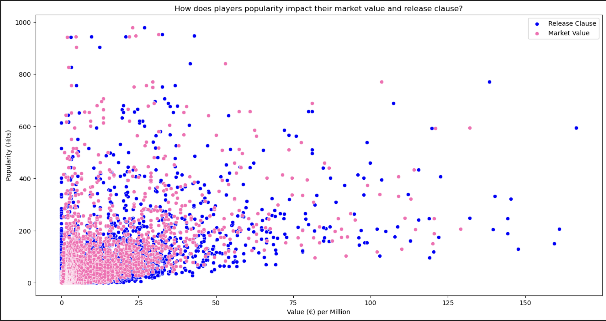
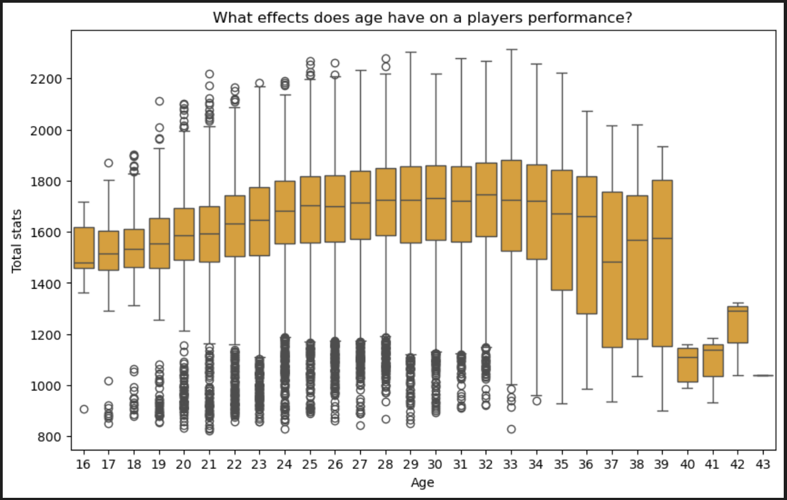

# Player-score
## 1. Topic and research question
This dataset provides detailed information about football players, including their physical
attributes, personal information, skills, wages, clubs, and the date they joined their clubs. Using
this data, it is possible to determine the market value, potential, and performance of each athlete.
This information influences decisions regarding the renewal, signing, or cancellation of contracts
with organizations or football clubs that may work with the athletes.
### Research questions:
* How does a player's popularity impact their market value and release clause?
* Which stats (Attacking Skills and Goalkeeping Skills) have the biggest effects on a
player's market value and pay, and how do these effects differ depending on the player's
position?
* What effects does age have on a player's performance (rating, skill attributes)?
  
This information will help football clubs identify players who fit their tactics and strategy. For
coaches, it assists in improving team playmaking and formation. Players can identify their
weaknesses and work on improving their skills, which in turn helps increase their market value.

## 2. Data description
The data selected is from the publicly available dataset titled "Player Score Regression." It was
downloaded from the Sofifa website, located at the URL: https://sofifa.com/players . The dataset
includes attributes for 18,979 football players. The provided dataset indicates that each player
has about 77 attributes. These attributes include financial information (wage, market value, etc.),
skill evaluations (dribbling, passing), physical characteristics (height, weight), and personal details
(full name, date of birth), amounting to a total of 1,461,383 data points.

## 3. Data ingestion and cleaning
### Data ingestion:
For this project, I primarily used the Pandas(3.0.1) library. Functions such as drop(), info(), describe(),
isnull() and to_numeric() were utilized to clean and analyze the data. The drop() function helped
remove irrelevant columns and rows with invalid values, while info() and describe() provided an
overview of the dataset's structure, mean , min and max values. The isnull() function was crucial
in identifying missing data, and to_numeric() ensured that values were correctly converted to
numerical types where needed.

### Data cleaning:
After conducting an initial examination of the dataset using describe() and info() functions to assess statistical properties, data types, and missing values, several cleaning steps were carried out. Outliers in the 'Rating in Scale 100' and 'Potential in Scale 100' columns were corrected by subtracting 100 from values exceeding the limit, while an invalid sixth category in 'International Reputation' was resolved by dropping the affected rows. Columns with excessive missing values were addressed by dropping 'LoanEndDate' (94.6% null) entirely and removing null rows from 'Popularity Hits' (13.6% null). Numerous irrelevant columns — including FullName, PhotoURL, Height, Weight, and ContractInfo — were removed as they fell outside the research scope, and individual skill columns were dropped in favour of their aggregated counterparts (e.g., AttackingSkills, MovementSkills, DefendingSkills). The final cleaned dataset retained 24 columns and 16,110 rows, totalling 386,640 data points, representing 26.4% of the original dataset.

### Exploratory data analysis (EDA)
* How does player popularity impact their market value and release clause?
  
The scatter plot explores the relationship between a player's popularity (measured in hits) and their financial value, represented by both market value (pink) and release clause (blue). The majority of data points are clustered at the lower end of the x-axis (0 - 25 million euros), indicating that most players in the dataset have relatively modest market values and release clauses. Despite this concentration, popularity hits vary widely even among lower-valued players, suggesting that popularity alone does not directly determine a player's market value. As values increase beyond 50 million euros, the data becomes increasingly sparse, reflecting the small proportion of elite, high-value players in the dataset. Notably, release clause values (blue) tend to sit higher on the popularity axis than market values (pink) at similar financial figures, implying that clubs set release clauses above perceived market value as a protective measure. Overall, there is a weak positive trend, higher-valued players tend to attract more popularity hits, but the relationship is not strongly linear, indicating that other factors beyond popularity contribute significantly to a player's market valuation.

* What effect does age have on a player's performance?
  
The box plot examines how total player stats (an aggregated performance measure) vary across ages 16 to 43. A clear inverted-U pattern emerges: performance steadily rises from age 16, peaks in the mid-to-late twenties (roughly ages 25–33), and then declines progressively into the late thirties and forties. Players aged 16–19 show lower median stats with tighter interquartile ranges, reflecting that younger players are still developing. From age 20 onwards, both the median and spread of stats increase, indicating growing skill diversity as players mature. The peak performance window (ages 25 to 33) displays the highest medians (around 1,700–1,850) and wider boxes, suggesting greater variation among established professionals at their prime. After age 34, a notable decline begins, with medians dropping and boxes narrowing, likely due to fewer older players remaining in top-level football. The numerous low outliers visible across all age groups represent players with significantly below-average stats, possibly due to positional specialisation (e.g., goalkeepers) or lower-league players included in the dataset.

 
dss
 
